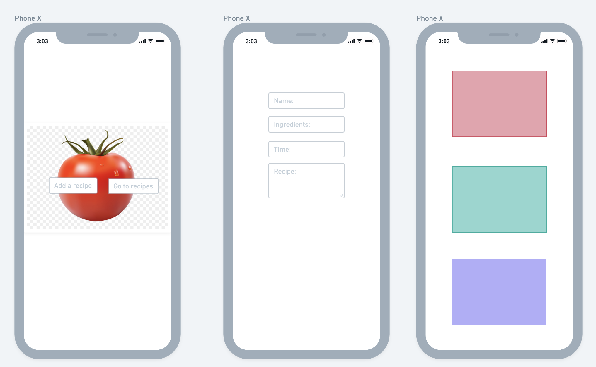
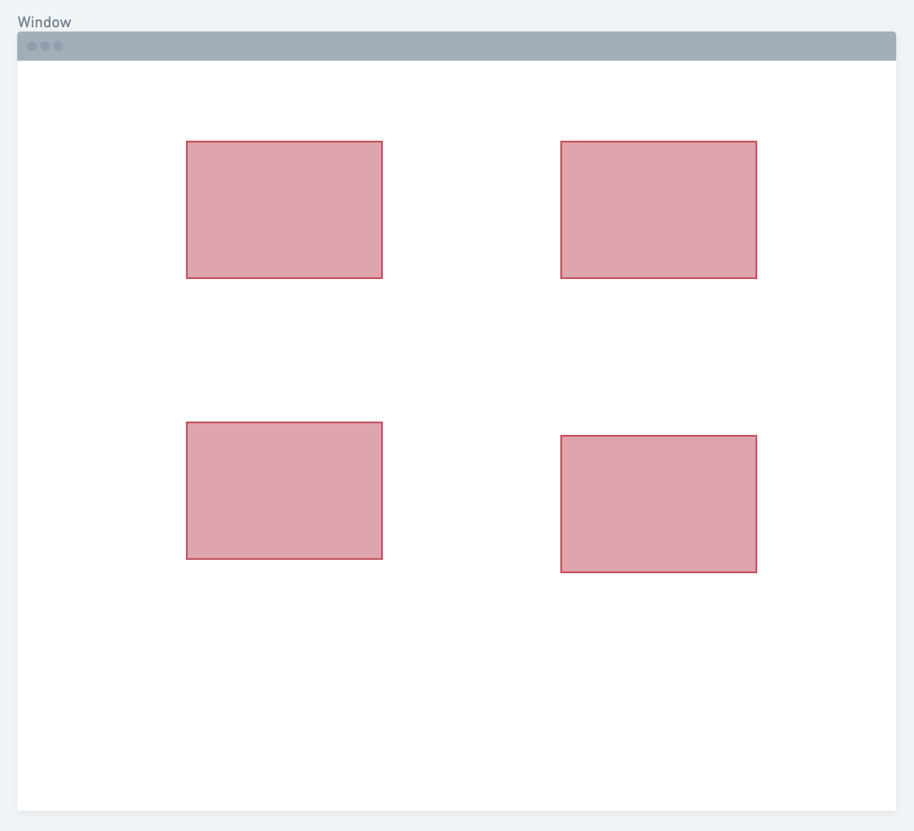
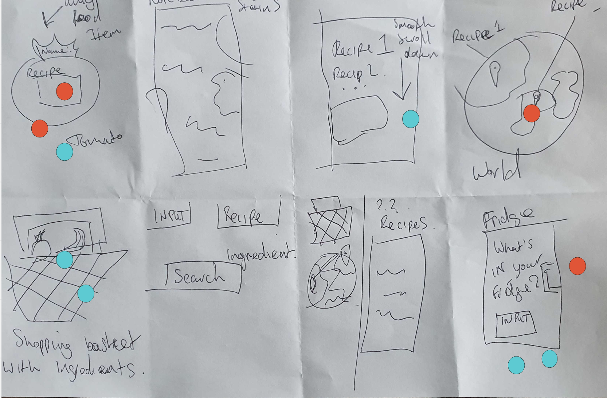
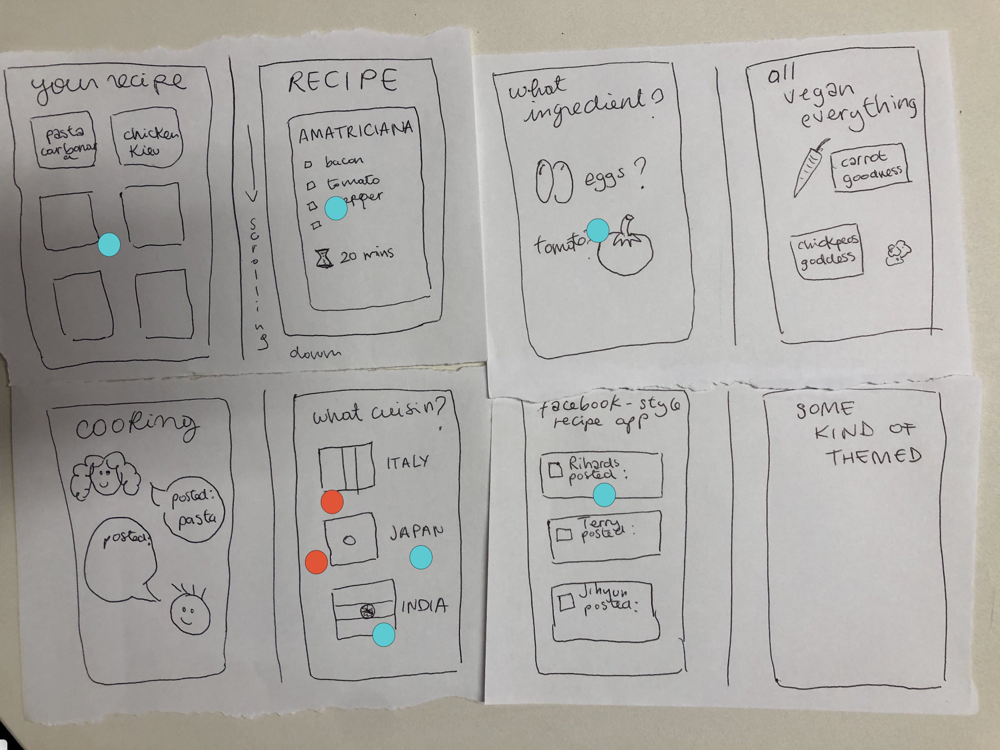
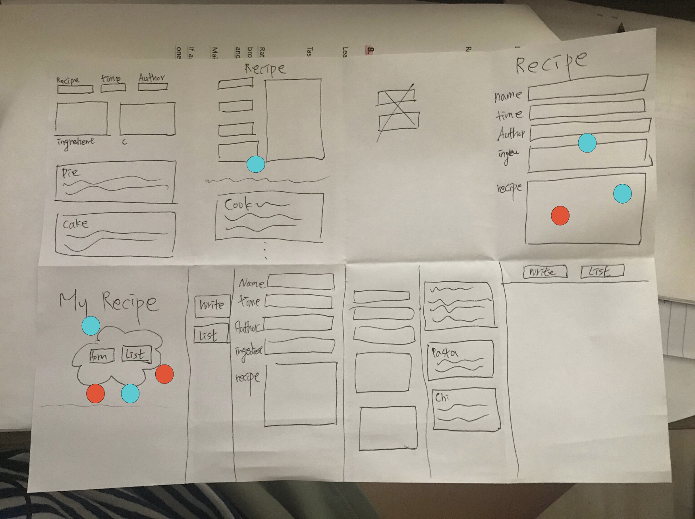
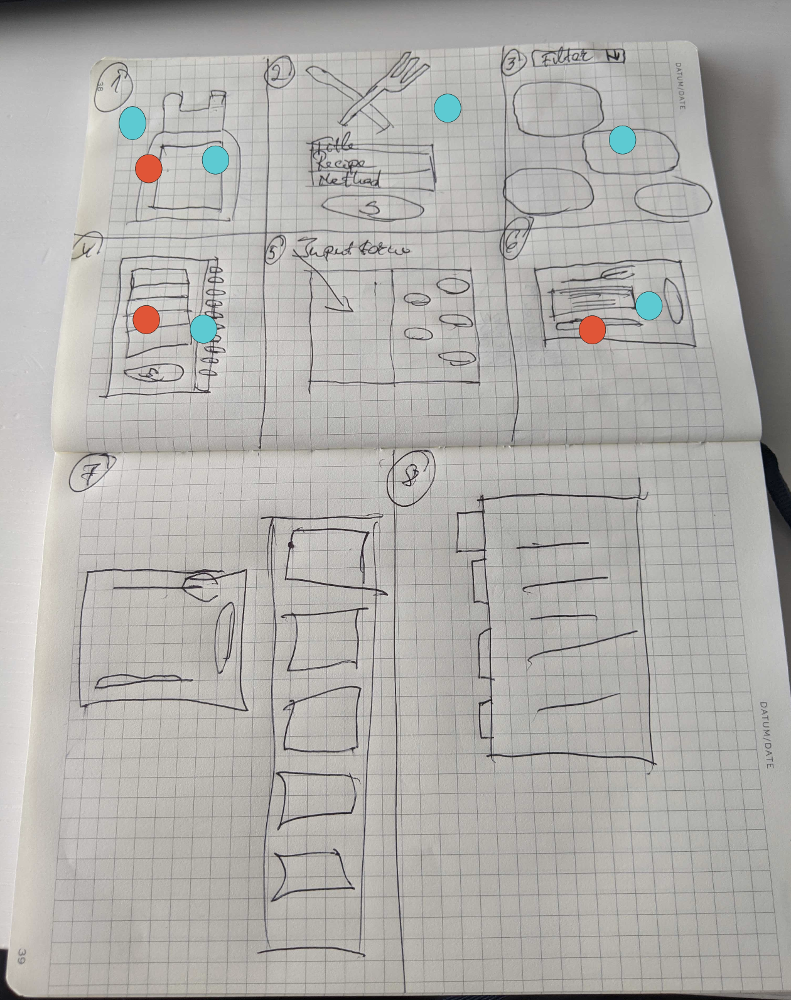

# What's cookin' puddin'? - your favourite recipe app


This project was created during the 5th week of [Founders and Coders'](https://www.foundersandcoders.com/) 20th cohort (a.k.a database week 😱). 

Our aim was to **get familiar with databases** (design and document a database schema, normalize our data to reduce duplication, create a relational database, etc..) and **SQL** (SQL queries, query parameters to avoid SQL-injection vulnerabilities) as well further our knowledge of **Node** (handle database errors on our server without crashing).

## To run our app

Clone the repo
create .env file (please request database URL from us)

``` 
npm install
node server.js 
```

Go to localhost3000

Have fun!!! 🥳🥳🥳

## Whimsical prototyping

Our aim was to create a simple app, with a landing page displaying our logo and a tomato with to buttons(iPhoneX 1 below), one to add a recipe which would bring the user to a simple input form (iPhoneX 2 below) and one to display all recipe in a sheet like manner(iPhoneX 3 below). We intended to have the latter in a display flex so as having multiple recipes displaying side by side in desktop version (window display below).

 



## Schema Info

Our database has two tables that are referencing each other on user id.

#### Users

| Column     | Type                                              | Constraints |
| ---------- | ------------------------------------------------- | ----------- |
| id         | SERIAL (translates to integer and AUTO_INCREMENT) | PRIMARY KEY |
| username   | VARCHAR(255)                                      | NOT NULL    |
| location   | VARCHAR(255)                                      |


#### Recipes

| Column       | Type        | Constraints          |
| ------------ | ----------- | -------------------- |
| id           | SERIAL      | PRIMARY KEY          |
| user_id      | INTEGER     | REFERENCES users(id) |
| recipe_name. | TEXT        |                      |
| time         | VARCHAR(255)|                      |
| ingredients  | TEXT        |                      |
| method       | TEXT        |


## Project timeline

This project was build over a 1.5 day sprint with the following times and pair-programming/mobbing modes:

**Day 1:**

11:15 - 11:45 Project discussion and ideation 

11:45-12:37 Made project board all together 

12:37 - 12:45 Reading each other's user manuals 

12:37 - 12:45 Roles meeting to discuss individual roles

14:00 - 14:15 Team chat about user manuals and project blue print

14:15- 15:15 Crazy 8s and Whimsical prototyping

15:15 - 16:00 Pair programming 

  - Jihyun/Terry: research to set up server 
  - Rihards/Lisa: HTML structure, log, form and images

16:00 - 16:30: SQL mobbing


**Day 2:**

10:00 - 10:20 Created package.JSON, merged pull requests

10:20 - 10:50 Created and talked through .gitignore and .env

10:50 - 11:50 Pair programming
  
  - Jihyun/Lisa: Created production database with the relevant tables(users, recipes)
  - Rihards/Terry: Created test.js file to testing if server is setup properly and connecting to homepage (index.html)
  
11:50 - 12:10 Git mobbing commit/push/merge

12:10 - 13:00 Pair-programming

  - Jihyun/Rihards: Created server.js, router.js and handlers.js (wrote missing handler and started working on home handler)
  - Lisa/Terry: Created connection.js and connected database  
  
14:00 - 15:20 Team stand-ups!

15:20 - 18:00 Resolved issue with try to connect to your remote Heroku database locally 
              Wrote public handler

Afterhours 🤫🤫 Wrote model.js with createNewRecipes function and getRecipes function which query to the database 
               Added to home handler function to get data from database and display in app
              


## Takeaway lesson

Heroku databases require a secure encrypted connection by default (“SSL”). node-postgres does not connect via SSL by default, but you can tell it to by passing an extra option like this:
    
``` 
  const options = {
    connectionString: databaseUrl,
    ssl: { rejectUnauthorized: false },
  };
  const db = new pg.Pool(options);
```

## Tools

- Heroku, not so well apparently 🤪
- Miro for crazy 8s 
- Whimsical for prototyping 
- Coffee ☕️☕️☕️


## Crazy 8s

 

 
  


## 🦄 The dream team 🦄

🌟 [Lisa](https://github.com/LiCern) - Scrum facilitator

🌟 [Rihards](https://github.com/RihardsJ) - Quality control

🌟 [Jihyun](https://github.com/Jihyun-Janghttps://github.com/Jihyun-Jang) - Deployment

🌟 [Terry](https://github.com/RunGT) - Design


